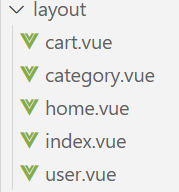

# 云逛街商城

## 一、项目启动

### 安装项目依赖的所有第三方库（根据package.json中的配置）安装依赖

```
npm install
yarn install
```

### 启动本地开发服务器运行

```
npm run serve
yarn serve
```

### 构建生产环境优化的代码（用于部署）

```
npm run build
yarn build
```

### 检查代码

```
npm run lint
```

### 自定义配置

See [Configuration Reference](https://cli.vuejs.org/config/).（Vue-cli配置参考）

## 二、项目介绍

## 三、开发流程

### 基于vue-cli自定义创建项目

```
create vue yun-shopping
```


### 引入vant

```
//安装vant
npm i vant@latest-v2 -S
//安装自动引入插件
npm i babel-plugin-import -D

//在 babel.config.js 中配置
module.exports = {
  plugins: [
    ['import', {
      libraryName: 'vant',
      libraryDirectory: 'es',
      style: true
    }, 'vant']
  ]
};

//在main.js中引入或者新建js文件
import { Button } from 'vant'
```


### 基于postcss插件实现vw适配

```
npm install postcss-px-to-viewport

// postcss.config.js
module.exports = {
  plugins: {
    'postcss-px-to-viewport': {
      viewportWidth: 375,
    },
  },
};
```

### 路由设计配置

一级路由分7个，首页、详情页、登录页、订单页、支付页、搜索栏、搜索列表

二级路由暂定为“我的、购物车、分类、首页”

### 二级路由配置

#### 首先配置导航栏样式

```
<van-tabbar active-color="#ff0000" inactive-color="#000">
  <van-tabbar-item icon="shop-o">首页</van-tabbar-item>
  <van-tabbar-item icon="apps-o">分类</van-tabbar-item>
  <van-tabbar-item icon="cart-o">购物车</van-tabbar-item>
  <van-tabbar-item icon="diamond-o">我的</van-tabbar-item>
</van-tabbar>
```

#### 二级路由规则与组件

创建路由、配置children、配置出口


